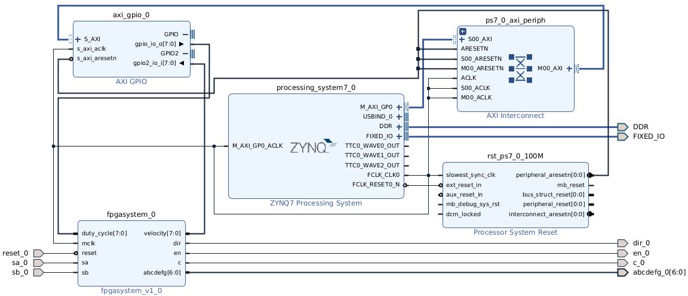

# Combine Zynq processor with your IP in a block design 

> [!NOTE]
> If you want to check that you are able to communicate with the Zynq processor before adding it to your IP, try the
> [Zynq Embedded Design tutorial](https://xilinx.github.io/Embedded-Design-Tutorials/docs/2023.1/build/html/docs/Introduction/Zynq7000-EDT/2-using-zynq.html) Example 1 and 2. 

When you have the Hello World application up and running, you can use the Zynq processor to anything, but you will need to incorporate the whole system in your vivado export to get the board set up.

The following texts takes you through the process of synthesizing implementing a block design that can be used in the vitis tool later. 

## Create a block design
Once the IP has been created, we can include this in a block design. 

* Create Project in your assignment folder
  * Use the name `O10-platform` and let vivado create that subfolder
  * Project type-> _Next_ (RTL project, no modifications)
  * Skip adding sources -> _Next_
  * Skip adding constraints -> _Next_
* Default part-> _Zedboard Zynq Evaluation and Development Kit 1.4 avnet.com Board rev d_
* Project summary -> _Finish_ (Check that it seems right, no actions required)

* Flow->_Create Block Design_ (or IP INTEGRATOR-> _Create Block Design_)
  * Give the design a name `O10_block_design` then _press OK_
* In the Diagram pane click the + button to _Add IP_
  * Add the Zynq 7 processing system (Search for Zynq)
  * Run Block Automation -> OK (no modifications required)
  * Press the checkbox to validate the design
    * This should cause an error since the clock is not connected.
    * Press OK on the Critical Message Box
  * Connect the `FCLK_CLK0` (Right hand side of the Zynq block) to the `M_AXI_GP0_ACLK`
  * Press the checkbox to validate the design
    * This should result in a succesful validation (_Press OK_).
* Press + _Add IP_
  * Add AXI GPIO (Search for GPIO)

The AXI GPIO Module will connect our IP to the Zynq processor, and must be configured to our system. 
  
* Double-click on the AXI GPIO module to open the "_Re-customize IP_" dialogue
  * Press the IP Configuration tab
  * Select _All outputs_ for GPIO
  * Enter GPIO Width `8`
  * Select _Enable Dual Channel_
  * For GPIO 2 Select _All Inputs_
  * Enter GPIO Width `8` for GPIO2
  * _Press OK_ (No further modifications required)

Before connecting our IP, we need to let vivado find our IP
* Menu _Tools->Settings_
  * Project Settings->IP->Repository
  * Add repository in the (empty) IP repositories box _+'button_
  * Select the top folder for this assignment (all subfolders will be included)
    * This shall give the response "1 repository was added to the project"
    * If the box doesn't show, it can be enlarged to show your fpga_system_v1_0 IP.
      Make note of your IP name if different.
    * _Press OK_
  * _Apply_
  * _OK_

Now you should be able to find your IP and add it to the diagram
*  _+ Add IP_
*  Select your _fpga_system_v1_0_ (search fpga)

Now your IP shall have appeared in the block diagram. 
Next step is to connect the GPIO (out) to the fpga_system duty_cycle and the GPIO2 to the velocity

* Click on the + to expand the GPIO and GPIO2 on the AXI GPIO right side.
  * Connect the `gpio_io_o[7:0]` to the `duty_cycle`
  * Connect the `gpio2_io_i[7:0]` to the `velocity`

* _Run Connection Automation_
  * (S_AXI shall be selected- if this was done before connecting GPIO, you would have to select S_AXI and deselect GPIO/GPIO2)
  * _OK_

This Creates two peripherals: a Processor system Reset and an AXI interconnect peripheral. 

The next step is to connect the FPGA system clock signal. 
* Draw a line to connect `mclk` input to the `F_CLK_CLK0` net (can be connected to anywhere on the line)
  * this ensures that our module is synchronized with the AXI GPIO module[^2].
    
[^2]: For large designs, connecting all on the same clockoutput may be a bad idea, but here it should work well. 

The remaining in- and outputs of the fpgasystem shall be connected to the output pins on the FPGA. 
This includes the reset signal which shall be connected to a button. 
It is OK to move the modules to get a better fit, but zooming in on the FPGA system is also fine
* Hold CTRL and click on the text for the remaining (not connected) inputs from the fpga_system to select all of them.
  * Right click on one of them and select _make external_
    (This can also be performed one at a time)

After having made external on the ports used, feel free to rearrange the placement of the modules. 
The button _optimize routing_ next to the "Default view"  can be used to clean up wires after placing modules. 

The Diagram should now look something similar to this:
|  |
| :---: |
| Complete block design |
    
* Click on the validate design (checkbox) to ensure that connections are good.
  * Click OK (correct errors if there are any).  

## Assign output pins
Now that the block design is complete, the next step is to assign pin outputs before synthesis and implementation. 
Before assigning pins, you will need to create a new toplevel, an "_HDL wrapper_" for the system. 

Navigate to the Block Design _Sources Tab_
* Expand _Design Sources(1)_
  * Right click on O10_block_design-> _Create HDL Wrapper_
    * Allow Vivado to manage wrapper and auto update

This changes the top design source to be "O10_block_design_wrapper". 
Having created an HDL wrapper, you can open the elaborated design to assign output pins:
* (Menu or Flow navigator) _Flow -> Open Elaborated Design_

This may take a minute. 
If the elaboration went well the message "Out-of-context module runs were launched for generating output products"
This means you can assign pins and select which voltages they shall use. 
* _Press OK_

At this stage you can add a constraints file, or manually assign pins and voltage standard for the new top level ("_O10_block_design_wrapper_").

> [!NOTE]
> As you may have discovered, the HDL wrapper will typically add a number postfixed to each signal (\<your signal>"_0").
> The postfix number is based on how many of each instance is generated, so it will be 0 for this project.
>
> Constraints from assignment 8 can be applied to the relevant signals as long as the new postfix is applied too.  

* Make the appropriate constraints (3.3V and location) for the external pins from the fpga_system.
  * The external pins from the Zynq processor (DDR and Fixed IO) will be correct by default.
* Save the constraints as `O10_constraints.xdc`
  * _It is OK to modify the constraints from assignment 8 and import these without changing names, just comment out all that is no longer relevant_ 

## Synthesis and implementation

Now that the pins are assigned, the system is ready to be synthesized and implemented. 
> [!NOTE]
> By using the clock from the processor system, we may omit specifying clock / timing constraints, since this is already provided by the tool.
> If a separate clock was used for mclk, this would have to be specified as with assignment 8. 

If we have set up the system correctly, we may now jump to generate the bitstream. 
It is ok to go step by step through syntesis and implementation to check each step, to understand and check that the process went correct. 

* Flow-> _Generate Bitstream_
  * Press _Yes_ to launch synthesis and implementation.
  * Press _OK_ to launch runs.
  * Press _OK_ to Open Implented Design.
  * Press _Yes_ to Close Elaborated Design. 
 
This process will take a minute or two. 
In the upper right corner the message "write_bitstream Complete" should be visible with a green check mark. 
In the Timing tab (bottom) and the Design Timing Summary, we should see the message "All user specified timing constraints are met"

Looking at The Check timing we should have these warnings:
* no input delay for reset_0, sa_0 and sb_0
* no output delay for abcdefg_0, c_0, dir_0 and en_0

> [!NOTE]
> If there are other warnings or errors they will need to be adressed before continuing.

Since we are working with slow output in the range of a few hundred Hertz up to a few kiloHertz, it is unlikely that we need to specify any timing constraints on these. 
If we were working with high speed I/O, these warnings would be something to address, but for this project we can continue without managing these. 

As the system stands now, the FPGA can be programmed, but we have not set up the firmware/software for the processor system. 

The next step now is to export the hardware setup, so that it can be used by the _Vitis Unified IDE_ (referred to as Vitis from here on). 
The exported hardware allows Vitis to set up the programming environment so we can use the Zynq processor with the AXI GPIO peripherals we have included in our design on the Zedboard. 

* File-> Export-> _Export Hardware_

This opens the Export Hardware Platform Dialogue
* Click _Next_
* Select Include bitstream
  * Click _Next_ 

Including the bitstream is not critical, because the Zynq processor can be programmed separately from the FPGA fabric. 
However, by including the bitstream, you can program both FPGA and processor from Vitis, which simplifies the process. 

If set up correctly, the Files dialogie can be accepted without modifications. 
You shold recognise the `O10_block_design_wrapper` XSA file name and the `O10-platform` folder. 

* Click _Next_ and read the summary.
* Click _Finish_

Once the setup has been exported, Vivado can be closed. 
The [next step](./build.md) will be launching Vitis to build the system and PID application.   

> [!NOTE]
> It is OK to program the FPGA and check that the LEDs light up when the motor is turned, as a way to confirm that the constraints were applied correctly. 

[Back](./readme.md)
