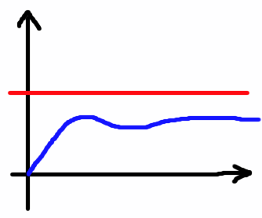
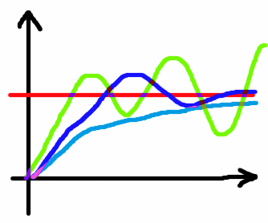
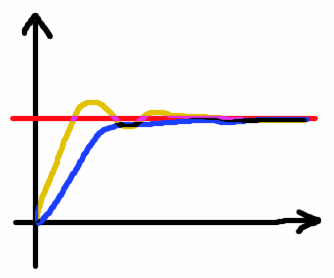

# PID Control

A control system that only uses a proportional gain _k<sub>P</sub>_ multiplied by the error value , will normally never reach the setpoint[^1]. 
|  |
| :---: |
| Proportional gain only. |

[^1]: A proportional gain may produce overshoot, but it will never settle at the setpoint.

A PID controller uses the current error along with the error history to provide a regulated value. 
The steps involved in generating PID control is relatively simple: 
* On a regular basis, you provide the system with updated error values. 
* The current error is multiplied by a constant (k<sub>P</sub>) to form the proportional (P) part of the PID control signal.
* To form the integral part of the control signal (I), you take the previous sum of errors, add the current error, then multiply that sum with a constant k<sub>I</sub>.
* The derivative (D) part is found by taking the current error and subtracting the previous error and multiplying the result with a constant k<sub>D</sub>.
* At last, you add all three values (P+I+D) to form the PID output value.

|  |  |
 | :---: | :---: |
 | P+I variants | Tuned PID |

The reason for using the integral I, is that P alone will not bring you to the setpoint. 
A system that is put under some sort of load, such as a motor that use energy to maintain speed, will never be able to reach the setpoint using P alone, since 0 error will give 0 output.
That is a motor will slow down until the error gets big enough that the power is big enough to maintain speed.
The integral part fixes this, as it will continue to grow as long as our error is positive, and it will shrink when the error is negative, thus it may bring the error to 0. 

In some cases, having P and I will be sufficient. 
However, a system using P and I, may also be either too slow in reaching the setpoint, or generate overshoot that makes the system unstable. 
To allow for fast control and dampen overshoot, the derivative part is introduced, as a brake when the error is changing too quickly. 


## Task PID implementation ##

```c
// error calculations, all scaled up by SETPOINT_SCALE
previousError = currentError;
velocity      = readVelocity(reverseDirection);
currentError  = mySetPoint - velocity;
sumError      = sumError + currentError;
deltaError    = currentError - previousError;

// Calculate P,I,D
P = myKp * currentError;
I = myKi * sumError;
D = myKd * deltaError;

// Calculate and scale PID output 
PID = (P+I+D) / VELOCITY_TO_SETPOINT_SCALE;
```
<sup>PID calculation in C</sup>

The prewritten PID calculation routine for this exercise is shown above (except for declarations and truncation to 8 bit signed values). 
It will run with a constant time interval. 
After initial testing, it will compensate for direction being wrong. 

_Direction errors this can be induced by a number of factors, such as reversed readout, reversed motor polarity, etc. (hence the reverseDirection identifier). 
The scaling (VELOCITY_TO_SETPOINT_SCALE) is used for allowing calculations to be done using integers without sacrificing too much fidelity._   

Once you get the system up and running, you can study how different PID constants (k<sub>P</sub>, k<sub>I</sub>, k<sub>D</sub> ) will work on this system. 

> [!NOTE]
> Finding the “best” constants for the PID routine can be challenging.
> What is best having one specific workload may be much worse in another.

There are many ways of tuning PID control systems. 
The preset values in this exercise has been hand tuned, and may cause values outside our predefined range of +-127 particularly when the load is high.

[Back](./readme.md)
