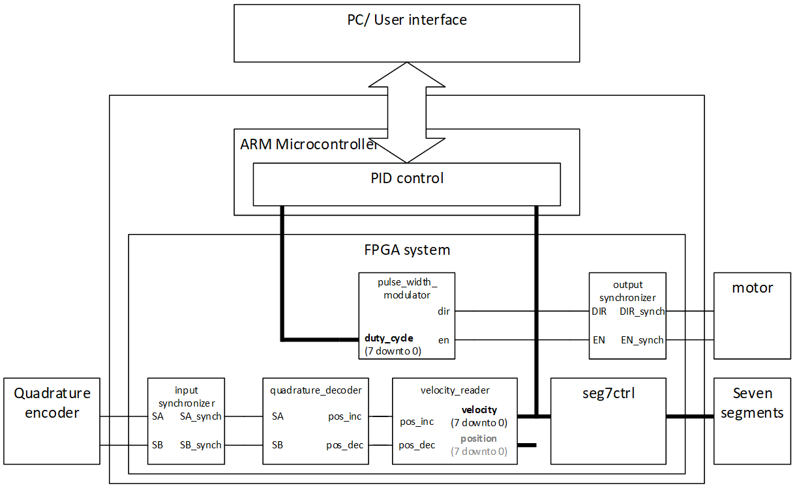
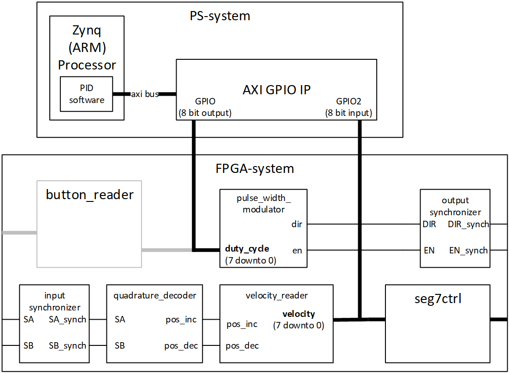
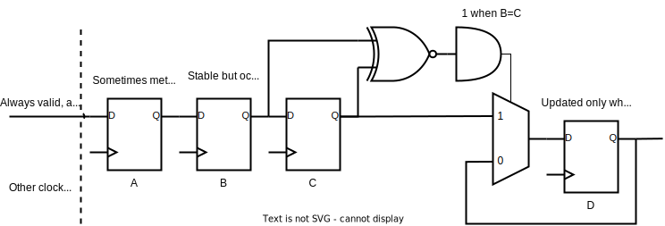

# Modifications to VHDL modules
## FPGA system in this exercise

An overview of the system to be implemented is shown in the diagrams below. 

|  |
|:---:|
| FPGA system overview |

|  |
|:---:|
| System overview with PS-system detailed |

The AXI-GPIO IP is implemented in FPGA fabric and connected to the AXI bus, but that IP is entirely managed by the tool. 
The GPIO IP will be used to serve as an interface between the processing system software and the FPGA system from assignment 8. 

The ARM processor will be set up to uses the AXI (Advanced eXtensible Interface[^1]) bus to communicate with the FPGA periphery. The IP core we connect will handle all the bus transactions needed, so we can utilize the processor output and set the processor input whenever we would like.

[^1]: The [AXI](https://en.wikipedia.org/wiki/Advanced_eXtensible_Interface) bus is a part of ARM Advanced Microcontroller Architecture 
   ([AMBA](https://en.wikipedia.org/wiki/Advanced_Microcontroller_Bus_Architecture) ) which is an open-standard interconnect specification for SoCs.

## Rebuild the vhdl top level 

The _self_test_ module from assignment 8 (shown as _button reader_[^2]) is grayed out, because it is not needed for this exercise. 
* The top layer from assignment 8 must be modified to accomodate for this change.

[^2]: During the pandemic in 2020, all exercises were run remotely, which in turn made the use of buttons impossible. 
   This lead to running a self-test module rather than button based user input to control the pulse width modulation.   

> [!NOTE]
> Unless the FPGA system uses the same system clock as the GPIO module, the input from the GPIO must be considered asynchronous to the FPGA system.
> In this assignment, you may use the AXI-clock for the whole system, thus implementing this synchronization is optional.   

## Optional: Synchronize the GPIO data[^3] 

[^3]: This is optional also because the consequences of reading the wrong values when they change is very small with this setup. 
  It is unlikely that an error will be used, and even if it gets used for a full period, that noise will normally be negligible. 
  However, it is a good choice to do this in order to understand and learn synchronization, and the circuit presented is useful in the real world. 

Since the data coming from the PID control is relatively slow, this can be mitigated by delaying the incoming data enough that the previous value matches the new value:
|  |
|:---:|
Synchronization for slow, always valid signals

As long as incoming data is stable for several clock cycles, this circuit can be used for synchronization. 
The circuit mitigates the n-bit problem in synchronization when no control signal is present. 

The cost of avoiding to propagate metastability and eliminating errors is thus a delay of 4 clock cycles. 
In the context of a system operating below 7 kHz, the delay is negligible.
The cost in registers (32 FFs) and ports could be reduced if a handshake control signal was implemented. 

* Create an input synchronization circuit for the duty cycle input to the pulse width modulator. 

This can be done either as a standalone module (_under the top module in the FPGA_system_) or as an addon to the pulse width modulator. 

[Next](./IP_creation.md)

[Back](./readme.md)
