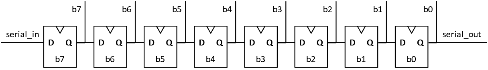
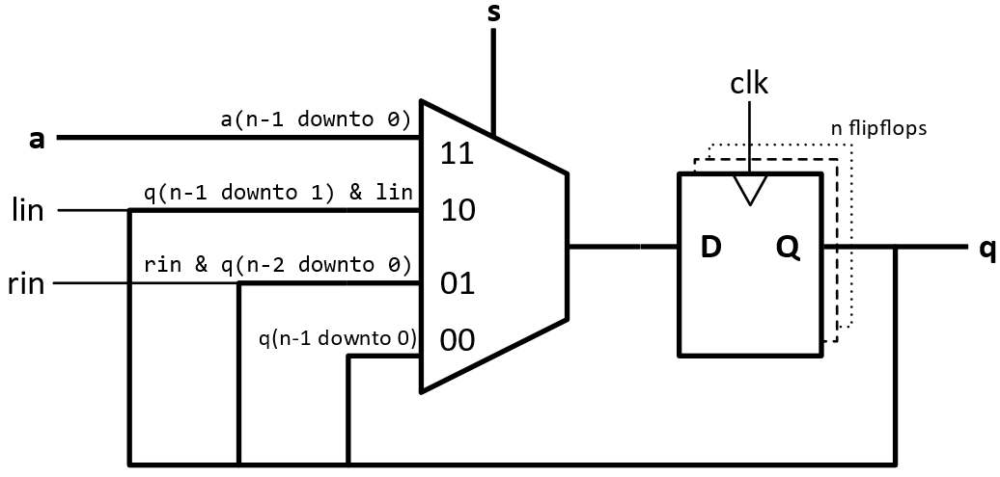

# Structural code using component instantiation
IN3160/4160
Version 2025-1

In this exercise, we will look at instantiation of components. 
The attached code in **[dff.vhd](./src/dff.vhd)** is a bit-register (flipflop) with synchronous reset. 
The register will receive the next value on each `rising_edge` of the `mclk`. 
This value will either be `'0'` when `rst_n` is active (low) or `din` when the `reset` signal is inactive. 
For this exercise, the `dff` component shall be used without modifications. 

The shift registers implemented in this assignment should have serial input and both parallel and serial output (both “SIPO” and “SISO” functionality).  
The shift registers shall have single bit input, there is no need to construct parallel input[^1]. 

[^1]: Shift registers are typically used for serial transceivers. Most known is “UART” - Universal Asynchronous Receiver Transmitter. 
  Fast board-to-board communication are normally never parallel, although you may have several serial transmitters working in parallel, each transmitter works individually to perform fast transfer rates and error correction. 

|  |
| :---: |
| <sup>8 bit shift register with serial input and parallel output</sup>|

|  |
| :---: |
| <sup>Bi-directional shift register with parallel load capability</sup>|

## a) 8 bit shiftregister ##
* Create an 8-bit shift register by instantiating the component dff 8 times, and call this component shift8. Use named association in port map.
* Create a test bench that simulates the shift register.

## b) 32 bit shiftregister ##
* Create a 32-bit shift register by means of the component dff and generate the statement.
* Name this component shift32. Use named association in port map.
* Create a test bench that simulates the shift register.

When using python testbenches with cocotb and GHDL, generics in the top level module can be given new values using SIM_ARGS += -g<GENERIC>  in the makefile. 

Example that sets generic “width” to 5: 
```makefile
SIM_ARGS +=-gWIDTH=5
```
As long as += is used with `SIM_ARGS`, multiple generics can be set by duplicating the statement for each generic parameter. 

## c) n bit shiftregister ##
* Create an n-bit shift register by means of a generic statement.
* Name this component shiftn.
* Create a test bench that simulates an instantiation of shiftn with the length set at 64 bit.

> [!IMPORTANT]
> **Approval:**
> VHDL source files and python test bench for the individual questions.
