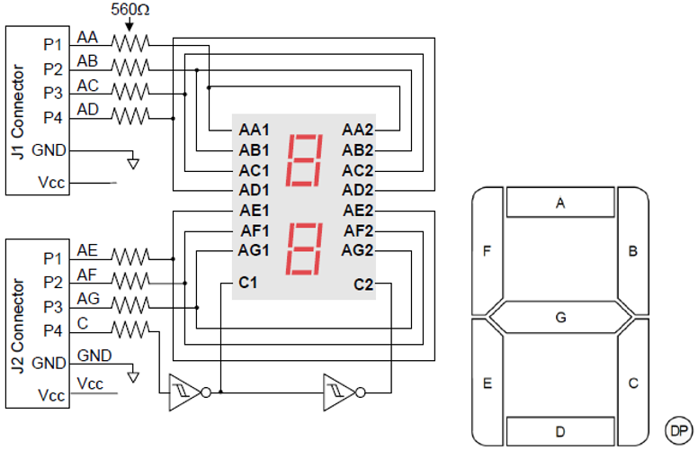
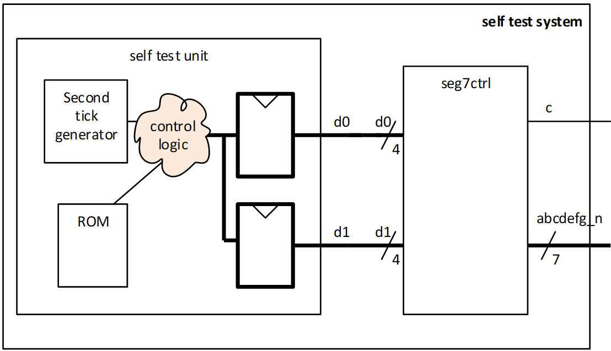

# Task description : Showing messages on a seven segment display

## Seven segment displays used in this exercise

|  |
| :---: | 
| Seven segment display connection diagram[^1] |

[^1]: Copied from the [PMOD Seven segment reference manual](pmodssd_rm.pdf)


| Di(3:0)	| abcdefg |	Character |
| :---: | :---: | :---: |
| i=1,0 |       |       |		
| 0000 | 1111110	| 0 | 
| 0001	| 0110000	| 1 | 
| 0010	| 1101101	| 2 |
| 0011	| 1111001	| 3 |
| 0100	| 0110011	| 4 |
| 0101	| 1011011	| 5 |
| 0110	| 1011111	| 6 |
| 0111	| 1110000	| 7 |
| 1000	| 1111111	| 8 |
| 1001	| 1111011	| 9 |
| 1010	| 1110111	| A |
| 1011	| 0011111	| B |
| 1100	| 1001110	| C |
| 1101	| 0111101	| D |
| 1110	| 1001111	| E |
| 1111	| 1000111	| F | 

<sup>Truth table for a seven-segment display</sup>

## a)	bin2ssd ##

```vhdl
entity bin2ssd_test is
  port
  (
    di        : in std_logic_vector(3 downto 0);
    abcdefg   : out std_logic_vector(6 downto 0)
  );
end entity bin2ssd_test;
```

* Create a VHDL function `bin2ssd` that implements the translation from binary number to seven segment code according to the truth table. 
* Use the function in an architecture with the entity given above and test your function using the provided testbench `tb_bin2ssd.py`. 

Optional: put the `bin2ssd` function in a separate package `seg7_pkg` that can be used later in this and coming assignments. 

## b)	seg7ctrl ##
In this exercise, you will implement control of the seven segments, so that all of them seem active simultaneously. 
It is possible to achieve this by creating a construction in which both displays are activated in sequence, using a high enough frequency. 
The human eye wcocotb.start_soon(Clock(dut.mclk, 100, units="ns").start())

cocotb.start_soon(Clock(dut.mclk, 100, units="ns").starill normally be unable to detect flicker from light being strobed at frequencies above 40-100Hz, depending on the duty cycle (duty cycle = on/off ratio). 
This can be achieved by using a counter to keep track of time.

The output `c` indicates which of the two displays are active, and the value of abcdefg must be according to `d0`/`d1` and the combinational function, depending on which of the displays are supposed to be active.

This module should have the following entity:
```vhdl
entity seg7ctrl is
  port
  (
    mclk      : in std_logic; --100MHz, positive flank
    reset     : in std_logic; --Asynchronous reset, active high
    d0        : in std_logic_vector(3 downto 0);
    d1        : in std_logic_vector(3 downto 0);
    abcdefg   : out std_logic_vector(6 downto 0);
    c         : out std_logic
  );
end entity seg7ctrl;
```

This module shall be synthesized, but testing on the board will be later in this exercise. 

* Create a testbench that uses a python dictionary such as in the provided testbench to verify that `abcdefg` are the are the decoded value of `d0` when `c`=0 and `d1` when `c`=1.
_You may choose to build upon the testbench provided or make your own_.

* Run the test bench simulation with the VHDL code. 

For arithmetic operations, such as +, -, * and /, use the `numeric.std` package (`use ieee.numeric_std.all`).

* How many bits must the counter have, and which bit is used to display clear characters on each of the seven segments?
    * If you are clearing your counter using a predefined value, how many bits do you need for this value.)

**Guidance:**
Create a block diagram that shows the data paths from d0 and d1 to the seven-segment displays. 
How should the counter be used? 
The counter and the decoder from oblig 1 and 2 may be useful here.

> [!NOTE]
> The seven segments uses a Schmitt trigger for the `c` signal which selects the display in use.
> This trigger has a delay which becomes significant if the display is used at high frequencies.
> To avoid one digit bleeding into the other, try use as low frequency as possible without causing visible flicker[^2].

[^2]: There may be other ways to avoid flicker, but they will either be very hard to control or cause dimmer digits. 
     One such way is inferring delays on the seven segment output, another is turning them off between each activation. 
     Both these will require much more complex code than just lowering the frequency to less than 200Hz. 

> [!TIP]
> While entity ports normally should be `std_logic`, it may improve readability to declare signals used as numbers (such as counter registers) as `unsigned`, to avoid excessive use of type conversions.
> Signals that are only used as numbers internally can be defined as `integer` or `natural`, just remember that they have a limited range of 32 bit including sign.

## c)	self-test unit ##
To be able to test the seven-segment module when it is 
synthetized and implemented on the FPGA (i.e. not in a 
testbench/simulation),you shall build a self-test module 
that displays a pre-defined pattern of characters and 
numbers on the seven-segment display.
The self-test unit shall feed a modified seg7ctrl module a 
sequence of characters.

* Create an alternative architecture for seg7ctrl, named 
seg7ctrl_arch.vhd.

In this file, copy the architecture from b) and replace 
the values for the seven segment output with the values given 
in the new seven segment code table (below).
This alternative encoding paired with the values for D1 and D0 
from the "Secret" message ROM table, that you will feed into your seg7ctrl, will display a “secret” message on the seven segment display when done correctly!

| Di	  | abcdefg		| Di	  | abcdefg |
| :---: | :---:     | :---: | :---:   |
| 0000	| 0000000		| 1000	| 0111011 |
| 0001	| 0011110		| 1001	| 0111110 |
| 0010	| 0111100		| 1010	| 1110111 |
| 0011	| 1001111		| 1011	| 0000101 |
| 0100	| 0001110		| 1100	| 1111011 |
| 0101	| 0111101		| 1101	| 0011100 |
| 0110	| 0011101		| 1110	| 0001101 |
| 0111	| 0010101		| 1111	| 1111111 |

<sup>New seven-segment code table</sup>

|  |
| :---: |
| <sup>The self-test system</sup> |

* Create a VHDL file for the self test unit.

The self test unit shall contain a counter that will create a signal “second_tick” that is active (‘1’) exactly one clock cycle every second. 
For each time the “second_tick” signal ‘ticks’, the self test unit shall change the value of D1 and D0 into seg7ctrl in accordance with the secret message table (below). 

Store the Secret message values that shall be sent into D1 and D0 in a ROM (file IO is optional[^3]). 
Access each value sequentially (two at a time, one value for each seven segment) every time a second passes to display the message. 
The message shall start over once finished.

* Create a testbench that gives stimuli to the self test unit (only a reset and a clock).

> [!TIP]
> For this task it is sufficient to check that `d0` and `d1` is what you expect and changing with every second_tick.
> Using a self-checking testbench is often faster than browsing waveforms, so feel free to do either. 
>
> When simulating it is ok to make second_tick faster by adjusting the counter limit.
> Remember to change this back when before implementing!

[^3]: Using File IO and some creativity, it is easy to create arbitrary long messages in a ROM. 
      Using both the displays you can create and decode almost any letter.  


| D1 (hex) | D0 (hex) |
| :---: | :---: | 
| 1	| 2 | 
| 3	| 4 | 
| 4	| 0 | 
| 0	| 0 | 
| 5	| 6 | 
| 7 |	3 |
| 0	| 0 |
| 8	| 6 |
| 9	| 0 |
| 0	| 0 |
| A	| B |
| 3	| 0 |
| 0	| 0 |
| C	| 6 |
| 6	| 5 |
| 0	| 0 |

<sup> «Secret» message ROM table</sup>

## d)	Implementation ##
* Implement the design on the zedboard, and check that it runs  and does what it is supposed to do.
  
To do this you shall wrap your `self_test` unit and `seg7ctrl` modules in a new module named `self_test_system`. 
This module does not have any inputs (only `reset` and `clock`), as all the data is handled made by the self test unit itself, but it does have two outputs. 
One `std_logic` for `c` and one `std_logic_vector[6:0]` for `abcdefg`. 
See the self-test-system figure (above).

* Create a testbench for the self test system.

This can be very similar to the one you made in task c) for self test unit. Verify that the outputs c and abcdefg is as you expect

* Create a project in Vivado with all your needed synthesizable design files and go through the Vivado workflow to assign pins to the ports of your module (See Table 3 below) and generate a bitstream.

* Make sure that there are no critical warnings and upload the bitstream.
  
The zedboard has a crystal oscillator that generates a 100MHz clock signal which is connected to the Zynq-7000 Package Pin Y9 
(See chapter 2.5 in the Zedboard user guide). 
Pin numbering on the chip can be found in the PMOD Connections in the Zedboard documentation. 

The reset signal shall be connected to the `BTNR` in the zedboard. 
Use the Zedboard User Guide to find the package pin correct pin. 

All input and output for the project is 3.3V.

| PmodSSD	| ZedBoard | Xilinx Zynq chip |
| :---: |:---: |:---: |
| Segment A	| JC1_P	| AB7 | 
| Segment B	| JC1_N	| AB6 |
| Segment C	| JC2_P	| Y4 |
| Segment D	| JC2_N	| AA4 |
| Segment E	| JD1_P	| V7 |
| Segment F	| JD1_N	| W7 |
| Segment G	| JD2_P	| V5 |
| c (CAT) 	| JD2_N	| V4 |

<sup>Seven segment board hardware pins</sup>

## e)	Optional (not required for approval): ##
Create a system that counts the each time the button BTNL is pressed and displays the count as a base10 number on the display. The system should be reset when pushing the BTNR button. 
	
> [!TIP]
> Use separate counters for each digit, rather than translating 8bit binary to two decimal numbers. 

How well does the number readout correspond to the times you push the button? 

Why is it like this? 

How can we achieve a better readout if we only want to count the actual number of times we physically press the button?  


Good luck!

[Back](readme.md)
