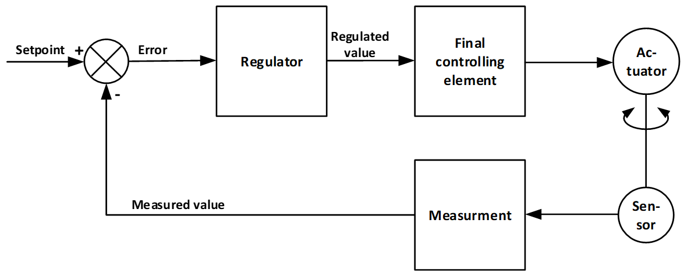
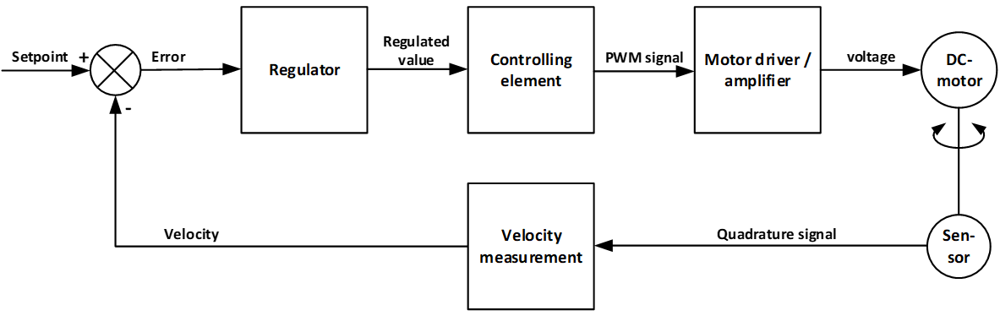
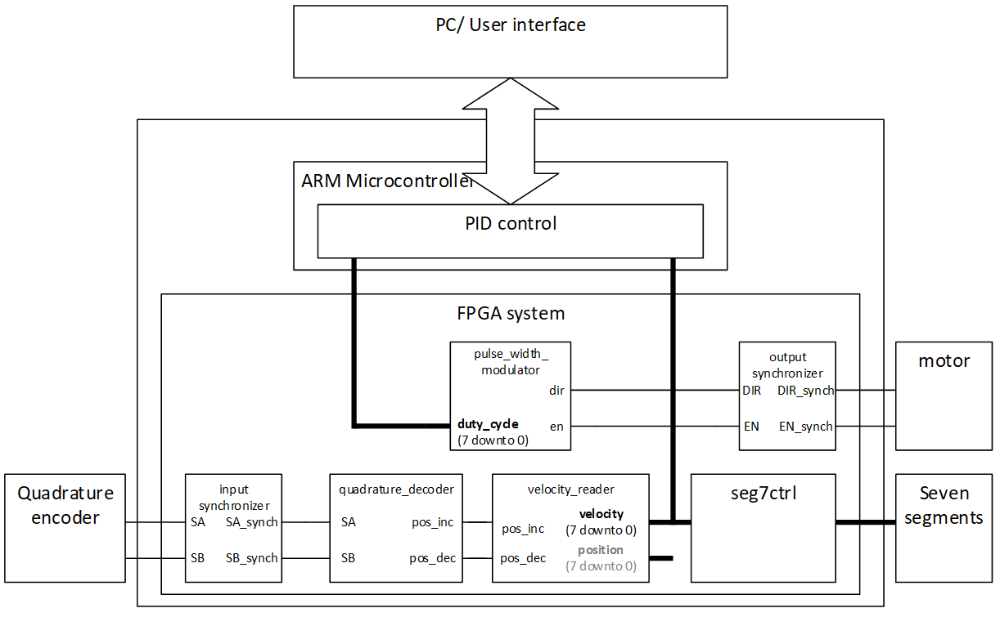

# Introduction

The goal of this lab exercise is to give you experience creating state machines and synchronization modules using HDL and integrating modules in a larger design. 
For each part of the exercise, you must follow the same design flow as in previous exercises. 

The ability to control/regulate the position, force and speed of a robot arm is a basic function for every robot. 
In this exercise, you will be creating an “IP” (Intellectual Property) module that will comprise the speed regulator for a motor. 

The output modules in this task shall be implemented on the Zedboard and will be used in later in oblig 10, together with a PID control running on the Zynq ARM core.

## Files
The "root" `O8` folder contains 
* the markdown `.md` files describing this task
* the data sheets `.pdf`s describing the components connected to the Zedboard.
* the subfolders described below... 

The `src` folder contains two files: 
* `velocity_reader.vhd`
  * A premade module that calculates speed from increment and decrement signals passed from the Quadrature decoder. 
  * _This file shall be used without modifications._
* `pwsim.vhd`
  * A premade simulation model of a pulse width modulator.
  * _This is included for demonstration purposes only._
    * It will simulate, but cause errors when tested with the premade testbench.   
  * Play with this model as much or little as you like, it will not be a part of your delivery.
  * Make sure this is removed or renamed when testing your own pulse width modulator. 

The `test` folder contains two files:
* `makefile`
  * _to run the premade testbench using GHDL_
* `tb_pwm.py`
  * the testbench to check your pulse width or pulse density modulation module
  * _This file shall be used without modifications_
    * Passing this test is a requirement to be allowed to program the board for this assignment.
    * It tests both safety and functionality of the pulse width modulator.

 The `images` folder contains images used in the task description
 * _These are only meant to be used with the markdown (.md) files._

 

## Regulation systems
 
 
Generally, a regulation system consists of an actuator we want to control and a sensor that measures the actuator output. 
The measured output is compared to our setpoint, which is the desired output for the system. 
The comparison results in an error signal [^1] that is fed back to the regulator. 
The regulator uses the error to calculate a regulated value. 
The regulated value is then translated by the final controlling element into a signal that will actuate the actuator. 

[^1]: An error signal is the deviation between the setpoint and the measured value <!--[↩](#error_signal)

 

In this exercise, you will create a system that control the velocity of a motor. 
In the end, the system will consist of a PID regulator written in software that will run on the Zynq ARM core, which will pass a regulated value that will be used by the controlling element written in HDL. 
The controlling element will provide a pulse-width-modulated signal that can be sent to an H-bridge (PModHB3) that will drive the motor. 
The motor shaft is connected to an optical quadrature sensor (YUMO E6A2-CW3C) that sends its output back to the FPGA through the Pmod HB3 module.
The quadrature output shall be be used to calculate a velocity value using HDL modules. 
The velocity value shall be displayed on seven segments used in earlier exercises, and it shall be used together with our setpoint to generate the error signal that can be fed into the PID regulator.  

The figure above illustrates the regulation loop, and its manner of operation is as follows:
1. We impress a desired value, ``setpoint`` that is the desired value for the velocity.
2. The ``setpoint`` is compared to a measured ``velocity`` which gives the deviation:
  ``error = setpoint - velocity``
3. ``error`` is used as input for the regulator, which processes this with some mathematical formula (favorable for what we want to regulate) and yields a result that is called the manipulated or regulated variable.
4. The regulated variable is used to control the final controlling element.
5. The final controlling element is usually some sort of driver circuitry, which applies current to the motor to create movement. 

In our case, the system consists of a module generating a PWM signal that are connected to the motor through an H-bridge. 

## System overview

A block diagram of the modules that will be used or created in the system is given below:
 

Creating this entire system is a tall order before finishing the first course in digital design, so we will circle in on specific parts, making the process manageable. 
One thing to note before doing that, is that when first starting a project, you will normally only have an idea of the major modules that will play a part in your design. 
In this design, there are several modules, some that were not identified initially. 
Thus, the initial block diagram may need to be refined several times during a design depending on the complexity. 

For this design, we have aimed for having two levels of HDL code- one structural level, and one level with modules written at the register transfer level. 
If the complexity were to grow much more, we might want to add another structural level to make the top level easier to comprehend. 
Doing so would need to be thought through carefully, to avoid creating a messy structure where RTL code exists at multiple levels. 
Having the same type of code at each level is advisable to keep the system read- and maintainable. 

[Back to readme](readme.md)
