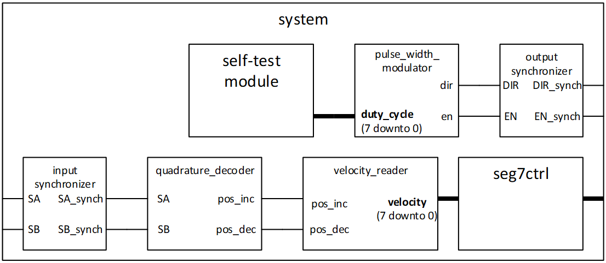

## Process for this exercise
In this exercise, you will go through the process of designing and testing the FPGA part of the overall system. 
In a later exercise (oblig 10), you will integrate this system with the processor system. 
The FPGA-system for this task is shown below:



**a)** The first task for this exercise is to create a self-test module that will provide an 8 bit signed duty cycle signal to the pulse width modulator (PWM module). 
   * The self test module shall provide at least 20 different values which shall be displayed for 3 seconds each.
     * The values should be stored in a ROM after being read from a separate text file during synthesis. 
       (This will make it easier to change values when testing the system).
     * In this pattern, full speed in each direction shall be tested, and the motor direction should visibly turn at least twice.
     * The last value sent to the motor shall be zero, to stop the PWM output. The test shall not repeat after finishing the sequence.
   * **Optional**: _Create a way to have the self-test include either a linear or sinusoidal sweep of PWM values, lasting 10 seconds before the 20 values that are required._

**b)** The next task for this exercise will be to create and simulate the PWM-module **pulse_width_modulator.vhd** that will be used to control the motor speed. 
   The test bench for this simulation is pre-made **tb_pwm.py**. 
   
   You can either
   * create a new pwm module or
   * Modify the pdm module from assignment 7 or
   * Use the pdm_module from assignment 7 as a submodule.

**c)**	After the pwm-module is tested and verified: 
  * create the in- and output synchronizing modules.
  * test the pwm-module and the output synchronizer together with the self-test module.
    
  You will need to decide for yourself which modifications will be needed to achieve this.

  **d)** Create and simulate the quadrature decoder. 
    
  In this case, you will be creating the testbench. 
> [!Note]
> _cocotb does not have access to custom types_, like state types.
> ``dut.state.value`` will return a binary value, just as any other signal from the **dut**.
>
> The binary value starts with 0 for the leftmost type value, and increases with one per position.
> Thus the first state has a value of 0, the second 1, the third 2, and so on.
> 
> To make sense of what state the dut is in during testing, you can use a dictionary that corresponds with the VHDL state type.
> Eg.:
```python
state_conv_table = {
    0: ‘state1’,
    1: ‘state2’, 
    ...}
```

**e)**	The quadrature decoder shall be connected to the input synchronization module and the pre-made velocity reader. 
  * Connect the quadrature decoder to the input synchronization module and the pre-made velocity reader.
  * Connect the velocity reader to the seg7ctrl module.
    * You will have to decide for yourself if you should modify the seg7ctrl module for this task. 
  
  _Note that the velocity reader output is an 8 bit signed_.
  An absolute value of this may be the best option to display on the seven-segments. 
  
  Hint: It is OK to only use Di(3 downto 0) for each display. 
  
When all these modules are put together, as shown in the figure, the system shall run a the self-test. 
The self-test shall demonstrate how the motor responds to the duty-cycle numbers coded in the test pattern. 
While the motor is running, the velocity value should be readable on the seven-segment display.

> [!important]
> Please hand in:
> *	VHDL source file(s)
> *	Python test bench for c), d)
> *	ROM content file for the self-test module. 
> *	Makefiles
> *	.xdc constraints files 
> *	Utilization report and Timing summary report
> *	Bit programming file for the final task. 
> *	A brief report that sums up what has been done, and thoughts on problems/challenges.
> *	_The system shall be run and shown to the lab supervisors for approval._
>   * If it is difficult to find time for this, record and deliver a video that demonstrates you running your system as specified.
>  
> All the submitted VHDL files should follow the naming rules for VHDL files and indenting guidelines as described in the cookbook.

[Back to readme](readme.md)


