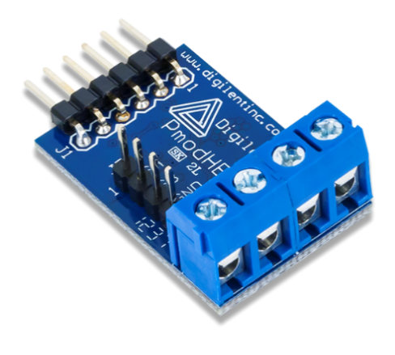
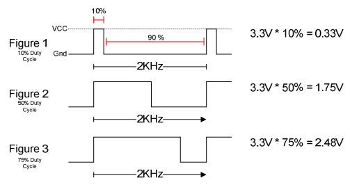
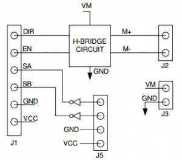
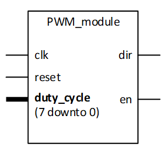
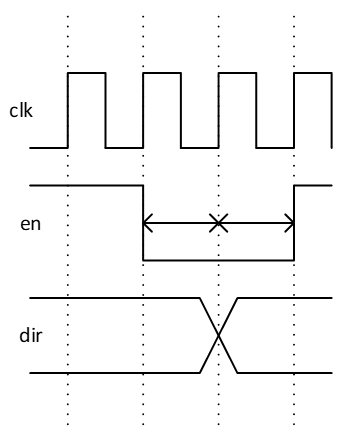
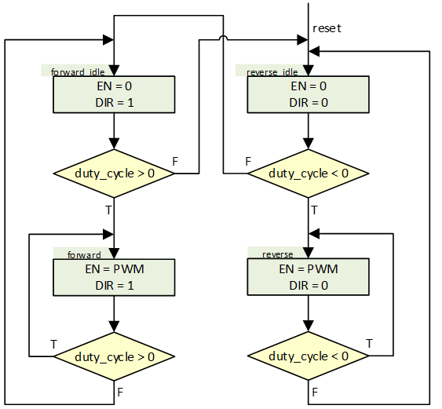

In this task, you will create a module “pulse_width_modulator” that can control the motor speed by using a pulse with modulated signal. 
The motor is connected to an H-bridge board (PmodHB3).

|  |  |
| :---: | :---: |
| <sup>**PMOD H-bridge module**</sup> | <sup>**Pulse width modulation**</sup> |
<!-- img src="./images/image009.png" width=33% height=33% -->

The H-bridge is controlled by two signals, DIR for direction and EN to enable output. 
Switching DIR will switch the polarity of the output, thus driving the motor in the opposite direction. 
> [!CAUTION]
> **DIR Must never change while enable is high**, since this will cause a short in the board.
> Thus, to avoid destroying the motor driver circuit, the pwm module must not allow this to happen.

<sup>
Technically, any transistor will need a certain time to turn on or off due to internal capacitance, usually stated in its data sheet.
This time may be several clock cycles when clock speed is at 100MHz or higher. 
In this assignment, we only require that EN is held low for one clock cycle before and after changing DIR. 
This works without causing heat build up since our pwm frequency- and direction changes -stays below 7KHz.
Thus it is safe to use the state machines as specified in this task.  
</sup>

| Pin | Signal | Description |
| --- | ------ | ------------|
| 1 | DIR | Direction pin |
| 2 | EN | Enable pin |
| 3 | SA | Sensor A feedback pin |
| 4 | SB | Sensor B feedback pin |
| 5 | GND | Power supply Ground |
| 6 | VCC | Positive Power supply |

<sup>**PMOD H-bridge pin description**</sup>



<sup>**PMOD H-bridge connection diagram**</sup>

* The EN signal shall be pulse with modulated. 

The pulse frequency will affect how well the pwm signal is able to drive the motor with no load. 
The data sheet refers to 2 kHz, which should be “safe”, but well within the audible spectrum. 
Selecting frequencies in the upper part of the audible spectrum (5-25 kHz) may yield unpleasant sound. 
Using higher frequencies heat up the PMod board while the motor impedance increases, thus the output frequency should be below 7 kHz. 

The H-bridge is connected to the top row of the pmod port JB1 on the Zedboard. 
_This can be hard to spot if/when using setups remotely._

 |  |  | 
 | :---: | :---: |
 | <sup>**PWM module entity**</sup> | <sup>**en when changing dir**</sup> | 
 

|  |
| :---: |
| <sup>**PWM module state machine**</sup> |


* Implement the PWM module using the entity and state machine diagram. 

The `duty_cycle signal` will be sent as a two-complement coded 8 bit `std_logic_vector`.  

* Use the test bench **tb_pwm_module.py** to test that the operation of the module is safe.

> [!CAUTION]
> **Do not use your module for implementation before the testbench can be run without errors or failures.**

When the test is passed, you can implement the module (you will do that later anyway).

> [!IMPORTANT]
> Please turn the motor or board off when you have confirmed operation, to avoid excessive wear on components.

> [!NOTE]
> **Hints for pulse width modulator:**
> 
> * Type convert to `signed`, when using `duty_cycle` in calculations.
>
> * _Using the **pdm module** from assignment 7_, either modified or as a submodule `mea_req` can be tied to zero, and the following constants are recommended to ensure safe operation:
> 
>   *	WIDTH: 20 bit
>   *	MIN_OFF: x”000FF”
>   *	MIN_ON:  x”00FF0”
>   *	MAX_ON:  x”FFF00”
>   
> * The `duty_cycle` provided by the given testbench (and processor system in the later assignment) provides an eight bit `signed` value (-128 to 127).
> In addition to converting this to `unsigned`, the `unsigned` value should occupy the most significant bits when converted to a wider word (typically 20 bit).
>
> * _If you are not using the pdm module from assignment 7:_
> 
>   * Pulse width modulation can be achieved by comparing an n-bit counter to the `duty_cycle` absolute value.
>   * To get a frequency lower than 7kHz use the most significant bits on an n-bit counter.
>   * The absolute value can be found using the `abs` function.
>   * The keyword `alias` can be used to give an alias to a signal or a part of a vector.

```vhdl
function "abs" (X : signed) return signed;
     -- Result subtype: signed(X'length-1 downto 0).
     -- Result: Returns the absolute value of a signed vector X.
```

```vhdl
alias <new_name> : <type><(range)> is <signal_name><(range)>;
-- example 
signal frukt : std_logic_vector(12 downto 2);
alias pærer : std_logic_vector(3 downto 0) is frukt(frukt'low + 3 downto frukt'low) 
```

[Back to readme](readme.md)
