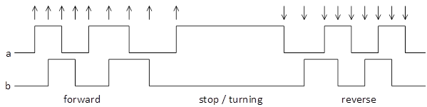

# Quadrature decoder
In this module, you will use the synchronized quadrature signals from the input synchronizer as input. 
The module shall hav two outputs, `pos_inc` and `pos_dec` that is used to signalize when the position increases or decreases. 
These signal shall be active (high) for exactly one clock cycle when the position increase or decrease.    
The output shall be connected to the premade module `velocity_reader`.

|  |  |
| :---: | :---: |
| quadrature_decoder |quadrature encoder operation |

> [!NOTE]
> SA and SB are not synchronized with our 100 MHz clock signal.
> Thus the output from the synchronization module from the previous task must be used as input to the quadrature decoder.
> Clock and reset signals shall be present, although omitted in the entity drawing.

| AB     | s_reset | s_init     | s_0           | s_1           | s_2           | s_3           | current state         |
| :---:  | :---:   | :---:      | :---:         | :---:         | :---:         | :---:         | :---:                 |
| **00** | s_init  | s_0 / ---  | s_0 / ---     | s_0 / dec     | s_reset/err | s_0 / inc     | **next_state** / **output**  |
| **01** | s_init  | s_1 / ---  | s_1 / inc     | s_1 / ---     | s_1 / dec     | s_reset/err |                       |
| **11** | s_init  | s_2 / ---  | s_reset/err | s_2 / inc     | s_2 / ---     | s_2 / dec     |                       |
| **10** | s_init  | s_3 / ---  | s_3 / dec     | s_reset/err | s_3 / inc     | s_3 / ---     |                       |

State table for the quadrature decoder

The (internal) signal `err` is for declaring an erroneous state change.  
_Normally this will never happen, as the encoder should be able to read all available speeds of the motor shaft._

|  |
| :---: |
| ASM diagram for the quadrature_decoder |

* Implement the FSM for the quadrature decoder as described above.

> [!NOTE]
> **Tip:**
> Sometimes, **a state table will be** both faster to make and **easier to read** than an ASM diagram.
>
> Multiple paths between states is a sign that this might be the case.
> _An ASM diagram will infer priority, whether that is necessary or not._
>
> In this case, creating a bubble diagram for S0, S1, S2 and S3 (set out in a circle),
> omitting S_reset and S_init, might help visualizing the valid quadrature transitions.
> Including the S_reset and S_init will likely make the diagram harder to read,
> and it is not necessary when using it as a supplement to the state table.

## About the quadrature encoder and the speed of the motor
In our system, the position sensor consists of an optical shaft encoder (Yumo E6A2-CW3C). 
Shaft encoders have a shaft and a permanently mounted part. 
The shaft is connected to the shaft of the motor, and the electrical output is connected to the feedback pins in the PMOD H-bridge. 
`A` and `B` can thus be read from `SA` and `SB` pin according to the diagram. 
Two pulses are received from the encoder, `a` and `b`, which have a 90 degree phase displacement. 
Which signal comes first depends on the rotational direction of the shaft. 
In our set-up we have the following relationship between the direction and phase displacement between the signals `a` and `b`:

|  |
| :---: |
| Position measurement. Arrows shows the detected transitions (inc/dec pulses) and their direction |

The encoder we use gives 200 pulses per round for each phase, which in total should enable us to read 800 positions for each round. 
That is we have 4 transitions of either `a` or `b` for each pulse period. 
By implementing the state machine described in the quadrature decoder task, 
the FPGA will generate one pulse for each change in position, as shown the figure above.

Note that the the maximum rotation speed of the encoder is 5000 RPM which in turn may give 4 000 000 transitions 
(or 1 000 000 pulses for each phase) per minute. 
This corresponds to a switching frequency of 16,7kHz and a transition frequency of 66,7kHz, 
both well below our master clock frequency of 100MHz. 

When connecting the motor directly to a 5V source, while unloaded, we can get around 300 RPM on the geared down shaft. 
The velocity module does provide velocity in terms of rounds per 10s (coded as an 8 bit signed vector), 
given that the quadrature decoder provides increment and decrement signals according to the task specification. 
The format of rounds per 10s was chosen to enable all usable values to fall within the range of an 8 bit signed (between -128 and 127). 

[Back to readme](readme.md)