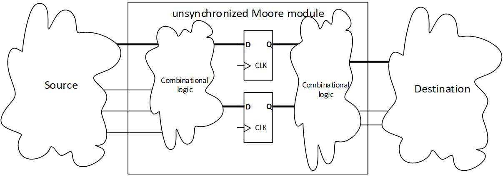
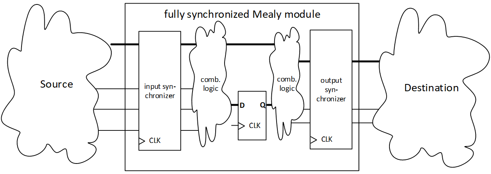
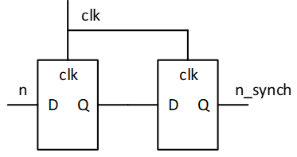
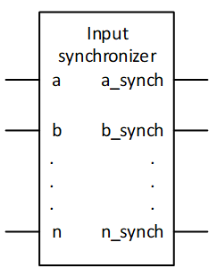

# Synchronization modules
When we construct modules that read or set data from other clock domains, there are two basic hazards:
1. Input from external sources may change at random, thus creating metastability and unpredictable behavior in our registers.
2. Our output, even those coming from stable sources as a Moore machine, 
   may be the source to glitches, due to combinational output based on our registers. 

|  |
| :---: |
| Moore type design in a non-synchronized environment  |

To avoid metastability when reading input sources, we need to use synchronization circuits. 
Depending on the input size and timing, we can use more or less specialized circuits, such as FIFOs or brute force synchronizers. 

To avoid glitches from the combinational output we may have two options- either create glitch free combinatorial output[^1], our simply put flipflops on all our outputs. 
The latter will be preferable if it can be permitted in the design, as it is easy to design and verify. 
In some cases, however, we may have to construct specialized combinatorial logic, to ensure proper behavior without resorting to output buffers. 

[^1]: Creating glitch free CL requires the use of Karnaugh diagrams, implicant cubes or equivalent techniques. 
  This is normally only useful in specific cases in ASIC design. 
  When using FPGAs LUTs will normally be applied to all combinational logic by the syntheziser. 
  It is thus unlikely that an FPGA design will be glitch free unless glitch free components are specificly instantiated.  

|  |
| :---: |
| fully synchronized Mealy module |

When we fully synchronize both inputs and outputs, 
Mealy type FSMs will generally be preferable when there is a choice, since they require the least amount of registers[^2].  

_Looking at the whole system, it can be seen as a Moore machine. 
However, it is beneficial to make the distinction between a system consisting of a Mealy machine with synchronization, compared to a Moore machine alone. 
Both Mealy and Moore machines may need output synchronization to ensure that the outputs are glitch free._ 

[^2]: This does not mean Moore machines should be avoided when they occur naturally. 
  Some designs will inherently end up as Moore machines, even when optimized. 
  Pipelined designs can always be seen as Moore machines. 

## ouput_synchronizer
The motor output shall be synchronized to avoid glitches causing the H-bridge to short circuit.
* Create a module containing flipflops for DIR and EN to avoid creating output glitches on these signals. 

For the seven-segment LED output, it is unlikely that the human eye will detect short glitches as long as the output frequency is low compared to the overall clock frequency[^3]. 
Thus, we do not require output synchronization on the seven-segment output. 

[^3]: LED flicker is unlikely to be seen unless it makes up a significant portion on of the pulse duration for a LED segment. 
  The human eye does typically not notice pulses shorter than 50% duty cycle of a 100 Hz signal (1/200s) which is 500000 cycles for a 100 MHz clock. 

## input_synchronizer
Without using buttons, only the input of the quadrature encoder is asynchronous. 
Synchronizing these will be a task for this exercise. 
Since the quadrature encoder output is gray code, we can use brute force synchronizers on the input. 

|  |    |
| :---: | :---: |   
| 1 bit brute force synchronizer | general synchronizer | 
 
* Create a brute force synchronizer module for the SA and SB signal from quadrature encoder.

The quadrature decoder shall use the output from the input synchronizer as its input. 

[Back to readme](readme.md)
