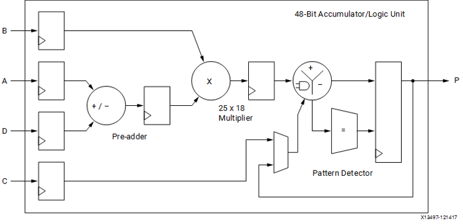

# RGB to Grayscale conversion
IN3160/IN4160 
Version 2025-01

## Introduction
The goal of this exercise is to get experience in calculating the need for extending bit numbers and managing overflow in arithmetic designs, along with managing pipelining and timing constraints. 

Getting practice in understanding and making good code is a secondary goal. 

## Background
An RGB image consists of three values per pixel, that is the value for red, green and blue. A 24 bits image thus has 8 bits for each color. 
Converting an image from RGB grayscale is computed by multiplying each color by a- weight and adding these together. 
In sum, the weights should add up to 1, so that the sum will be of similar magnitude of a single color. 
However, the weights are normally not the same for each color, but adapted to how our eyes perceive brightness. 

An example of grayscale conversion is as follows:
`Y = 0,299R + 0,587G + 0,114B`   

Where Y is the weighted average used as grayscale luminosity value. 
Sometimes more decimals or other weights are used, depending on the image source or accuracy requirements. 
The sum of these weights should normally be 1. 

In the following tasks, you will create a pipeline for a module that computes grayscale conversion of image data. 

When performing calculations in an FPGA, we restrict the usage of decimal numbers and division that are not by 2<sup>n</sup>. 
Dividing by 2<sup>n</sup> is implemented by shifting right n bits. 

If we want to convert a 24 bits RGB pixel to 8 bits RGB, we can do so by multiplying the weights by 28. 
We can thus calculate weights as follows (all rounded down): 


**W<sub>R</sub>** = 0,299*256 ≈ 76

**W<sub>G</sub>** = 0,587*256 ≈ 150

**W<sub>B</sub>** = 0,114*256 ≈29 	


More bits (10-12) can be used, but in this exercise, 8 bits are sufficient. 

If we start out with 24 bits RGB pixel, having 8 bits for red, 8 bits for green and 8 bits for blue,  
the weighted sum, **Y**= W<sub>R</sub>*R + W<sub>G</sub>*G + W<sub>B</sub>*B, will only use 16 bits, given that the sum of the weights is less than 2<sup>8</sup>. 
The result use only the most significant 8 bits[^1].

[^1]: Without knowing the actual weights in use, the circuit should keep track of all possible overflow in the arithmetic operations. 
For images it is normal to use the highest number (xFF) for blown pixels rather than a random outcome of the lower bits from the result. 


## Task 1: Questions
Please answer the following questions using full sentences.,. 

### Question 1:
We have two numbers a and b which are 8 bits each.
* How many bits is the result of the sum of these two numbers (i.e. a + b) ?

### Question 2:
* How many bits is the result of multiplying two 8 bits numbers (i.e. a * b) ?

### Question 3:
a, b, and c are 8 bits each.
* How many bits is the result of adding all these numbers a + b + c ?

### Question 4: 
We multiply the sum of four 8 bits numbers with the number e which is 8 bits.
* How many bits is the result of (a + b + c + d) * e ?

## Task 2: Pipelining
In the module grayscale, further down, the `R`, `G` and `B` values are multiplied by weights.  
Their sum creates the grayscale luminance value. 
Using properly scaled weights, the luminance value, `Y`, should never use the full range of bits used in calculation[^2]. 
If too large weights are used, the weighted sum will overflow the intended range. 
When causing overflow, all bits in the luminance value should be set to `‘1’`. 

[^2]:Properly scaled here means that they will sum to 255 when using 8 bit (2<sup>8</sup>-1) 

The module can be simulated with `tb_grayscale.py`. 
The testbench uses an image as input data and creates an image output to visualize the result. 
The image output can be scaled down to reduce simulation time, as only a fraction of the image data is used[^3]. 

[^3]:The testbench here runs multiple tests that triggers separately every clock cycle, which is not very efficient. 
If runtime was paramount, having a single monitor task passing data to each checker would be more efficient than bouncing between the simulator and python module several times. 
However, optimizing the testbench for speed is not a goal here. 
Learning to create tests that can be understood and modified is _much_ more important. 


```vhdl
library ieee;
use ieee.std_logic_1164.all;
use ieee.numeric_std.all; 

entity grayscale is
  generic ( N : natural := 8);
  port(
    reset, clk          : in  std_logic;
    R, G, B, WR, WG, WB : in  std_logic_vector(N-1 downto 0);
    RGB_valid           : in  std_logic;
    Y                   : out std_logic_vector(N-1 downto 0);     
    overflow, Y_valid   : out std_logic
  );
end entity grayscale;

architecture RTL of grayscale is
  signal next_Y, r_Y               : unsigned(N-1 downto 0);
  signal next_valid, r_valid, 
         next_overflow, r_overflow : std_logic;
begin
  -- output from registers
  Y        <= std_logic_vector(r_Y);
  overflow <= r_overflow;
  Y_valid  <= r_valid;
  
  REG_ASSIGNMENT: process(clk) is  
  begin 
    if rising_edge(clk) then 
      if reset then 
        r_Y        <= (others => '0');
        r_valid    <= '0';
        r_overflow <= '0';
      else 
        r_Y        <= next_Y;
        r_valid    <= next_valid;
        r_overflow <= next_overflow;
      end if;
    end if;
  end process; 
  
  CALCULCATION: process (all) is
    variable i_sum  : unsigned(2*N+1 downto 0);
    variable i_R, i_G, i_B : unsigned(2*N-1 downto 0);
    variable i_overflow   : std_logic; 
  begin
    i_R := unsigned(WR) * unsigned(R);
    i_G := unsigned(WG) * unsigned(G);
    i_B := unsigned(WB) * unsigned(B);
    i_sum := 
      unsigned("00" & i_R) + 
      unsigned("00" & i_G) + 
      unsigned("00" & i_B);
    i_overflow := or(i_sum(i_sum'left downto i_sum'left-1)); 
    next_Y <= (others => '1') when i_overflow else i_sum(2*N-1 downto N);
    next_overflow <= i_overflow;
    next_valid <= RGB_valid;
  end process;
end architecture RTL;
```

A DSP block implemented in FPGAs is shown in the Figure below: 
||
|:---:|
|<sup>Xilinx DSP 48 architecture</sup>|

A DSP block contains one 18 bits multiplier. 
The grayscale module requires multiple DSP blocks in series to perform the three multiplications before doing addition. 
Finding the exact best fit for a module is not a goal here, but it a module using multiple DSP blocks benefits from pipelining if we want to maximize the clock frequency used by the module. 

A quick run on the math shows that a single grayscale module has to be clocked at about 830 MHz if it is set to calculate grayscale image from a 4K source running at 100 Hz (3840 x 2160 x 100 Hz). 
This is a higher clock speed than most FPGAs support. 
However unlikely reaching 800 MHz is for this task, the focus shall be on how we can make a reasonable effort pipelining the RTL module. 
This does not mean to break up adders and multipliers into pipelined versions (that would be a huge task).   

What we want is a simple pipeline that avoid mixing data between pixels and is able to produce control signals `Y_valid` and `overflow` corresponding to the incoming data.  

The task shall be implemented as follows:

1. First test the testbench using the provided code. 
    Find an image to convert into grayscale. Scale the output to achieve reasonable simulation time.
2. Create a data path diagram of the existing grayscale module. 
    Note that we do use registers on all output. 
    Input registers are normally not a part of the data path-diagram unless they are a part of the module (which they are not).
3. Note how many flipflops are used in the original module, given the generic N.
4. Create a data path diagram of a two-stage[^4] pipelined version of the grayscale converter. 
   Make sure control signals follow the data. Note that two-stage means that there are two calculating steps .
5. Note how many flipflops are used in the pipelined version.
6. Modify the testbench `valid_check` and `gray_check` to allow for output that is delayed by one clock cycle. 
   The stimuli and grayscale image builder can and shall run without modifications.
7. Modify the grayscale VHDL module to match the data path diagram. 
   Test the module using the testbench with a color image of your own making[^5]. 
   The image output should be recognizable aside the original (minimum 100 pixels in both width and height)

[^4]: There is no such thing as a “one-step” pipeline - that would be called “not pipelined”.
[^5]: Preferably a photo of something not too personal for storing in canvas, such as “a shoe”, “a pet”, etc. that you created.   

**Optional:** 
_Use Vivado synthesis tool to determine the resource usage (FF’s, DSP units and LUTs) and if the timing holds using either 100- or 200MHz clock._

> [!IMPORTANT]
> **Approval:**
> *	A pdf file containing diagrams and answers to questions
> (full sentences required for each answer, diagrams must be created by a digital tool, such as diagrams.net / draw.io)
> *	A zip file containing:
> 	* VHDL source files
> 	* Modified Python testbench
> 	* Makefiles and waveforms
> 	* Simulation output (kjøreeksempel)
> 	* Source- and created images for task2


>[!NOTE]
> **Supervision guide** (for lab supervisors)
> *	Comment on the questions if they are incorrect.
>	* _Omitting answering or not using full sentences = fail_. 
> *	The first diagram should match the code to be approved. 
> *	The second diagram should show a 2-stage pipeline that will work. 
> (matching control and data)
> *	The VHDL and testbench should compile and run without errors to be approved.
> 	* It is OK to demonstrate this in lab.
>     _Please make note in canvas!_
> 	* _Omitting tests to pass = fail_.
> 	* Control and data should follow each other to be approved. 
> 	* Comment on tests that do something wrong.
> 	* The concept should be understood, not perfected. 
> *	The images have no strict requirements other than being unique. 
>   * _Using the same images as others = fail_. 


